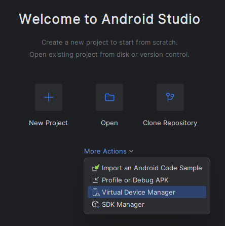

## Setting up environment

<Steps>
  <Step title="First Step" icon='github'>
    Follow the cloning procedure stated in [Development](/guides/development)
  </Step>

  <Step title="Second Step" icon='java'>
    #### Windows
    
    Install [Adoptium JavaJDK 21](https://adoptium.net/temurin/releases/?version=21&os=any&arch=any)

    Make sure to enable "Add JAVA_HOME to PATH" during installation.

    #### MacOS

    ```bash
    brew install openjdk@21
    ```

    ```bash
    sudo ln -sfn /opt/homebrew/opt/openjdk@21/libexec/openjdk.jdk /Library/Java/JavaVirtualMachines/openjdk-21.jdk
    ```

    ```bash
    echo 'export PATH="/opt/homebrew/opt/openjdk@21/bin:$PATH"' >> ~/.zshrc
    ```

    #### Linux
    - Fedora: `dnf install java-21-openjdk`
    - Arch: `pacman -s jdk21-openjdk`
    - Debian: `apt install openjdk-21-jre-headless`
  </Step>

  <Step title="Third Step" icon='android'>
    Install [Android Studio](https://developer.android.com/studio/archive)
    
    
    <Note>Make sure to download Meerkat Feature Drop | 2024.3.2 from the page</Note>
  </Step>

  <Step title="Fourth Step" icon='code'>
    Add these paths to your environment variables

    ```powershell
    C:\Users\$USER\AppData\Local\Android\Sdk\emulator
    ```
    
    ```powershell
    C:\Users\$USER\AppData\Local\Android\Sdk\platform-tools
    ```
  </Step>

  <Step title="Fifth Step" icon='mobile'>
    Create a virtual emulator device on Android Studio

    

    or connect your android phone to your computer with USB debugging enabled from Developer settings.

  </Step>

  <Step title="Sixth Step" icon='code'>
    Generate a keystore by running the command and following the instructions

    ```bash
    keytool -genkey -v -keystore debug.keystore -alias key0 -keyalg RSA -keysize 2048 -validity 10000
    ```

    Rename the empty `example.env` to `.env` in the project root

    ```ini
    KEYSTORE_PATH=<path to your .keystore file>
    KEYSTORE_PASSWORD=<keystore password>
    KEY_PASSWORD=<keystore password>
    KEY_ALIAS=<key alias>
    NODE_ENV=development
    ```

    and fill the example values according to the instructions

    <Note>You can run the `pwd` command to get the current absolute path of the folder for keystore</Note>

  </Step>

</Steps>

## Running the app

<Steps>
  <Step title="First Step" icon='code'>
    Start the Vite development server

    ```sh
    yarn start:renderer
    ```

  </Step>
  <Step title="Second Step" icon='android'>
    Start the Capacitor development app

    ```sh
    yarn cap run android -l --port 6969 --host 127.0.0.1 --forwardPorts 6969:6969
    ```

    <Note>The following command will promt you for device selection, select your Emulator or real device and it will install and launch the development app</Note>
  </Step>
</Steps>

## Debugging (via ADB)

You can see the debug logs with ADB

```bash
adb shell 'logcat --pid $(pidof moe.geoxor.amethyst)'
```

## Debugging (via Devtools)

Devtools can be launched in the target device, follow [these steps to see how](https://capacitorjs.com/docs/vscode/debugging#use-chrome-inspect)