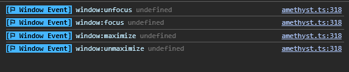

Amethyst's window will emit these events when window state changes



### window:maximize

Emits when the window is maximized

```ts
amethyst.on("window:maximize");
```

### window:unmaximize

Emits when the window is unmaximized

```ts
amethyst.on("window:unmaximize");
```

### window:minimize

Emits when the window is minimized

```ts
amethyst.on("window:minimize");
```

### window:focus

Emits when the window is focused

```ts
amethyst.on("window:focus");
```

### window:unfocus

Emits when the window is unfocused

```ts
amethyst.on("window:unfocus");
```